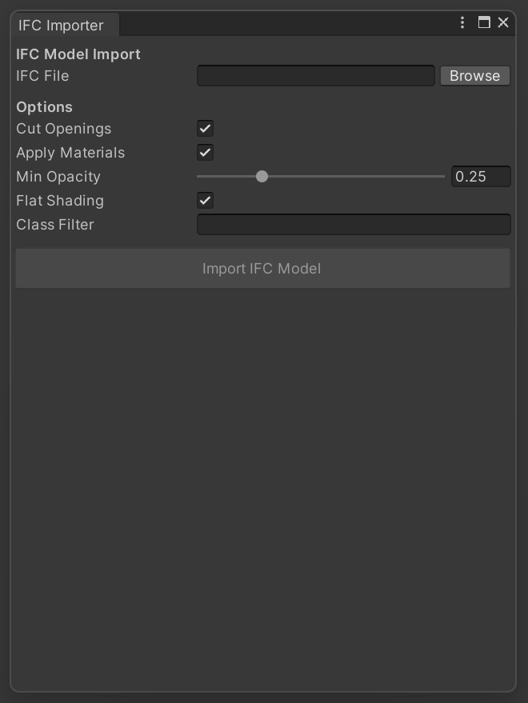
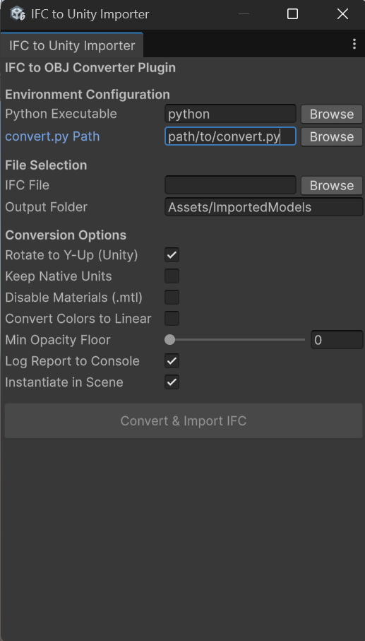

# IFC Converter

## Introduction

This repository contains a utility for converting Industry Foundation Classes (IFC) files into Wavefront OBJ models. The tool generates both the OBJ geometry file and the associated MTL material definition file.

## Requirements

- Python 3.x
- Dependencies listed in `requirements.txt`

## Installation

Install the required Python packages:

    pip install -r requirements.txt

## Usage

Execute the converter using the Python interpreter:

    py main.py

## Unity Integration

A custom C# Editor plugin is provided to convert and import IFC models seamlessly inside the Unity Editor without relying on external third-party OBJ importers.

1. Place the `IFCImporterWindow.cs` script into an `Editor` folder inside your Unity project (e.g., `Assets/Editor/`).
2. In the Unity top menu bar, navigate to **IFC Converter > Import IFC model**.

3. This opens the importer panel.

4. Configure the Python Executable path and select your `convert.py` script.
5. Select your source `.ifc` file, adjust your desired settings (such as keeping the Unity-friendly Y-Up rotation), and set your output folder.

6. Click **Convert & Import IFC**. The tool will run the Python conversion, load the generated files into the Asset Database, and automatically instantiate the 3D model into your active scene.

## Output

Upon successful conversion, the tool creates an output directory within the `output` folder. The directory is named after the source IFC file and includes:

- OBJ file
- MTL file

For example, converting `VeryBeautifulHouse.ifc` produces:

    output/VeryBeautifulHouse/VeryBeautifulHouse.obj
    output/VeryBeautifulHouse/VeryBeautifulHouse.mtl