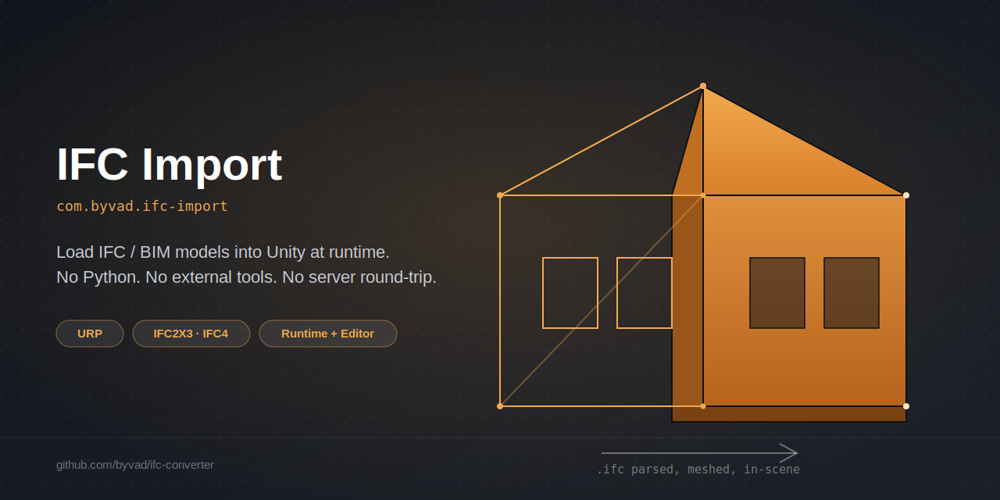
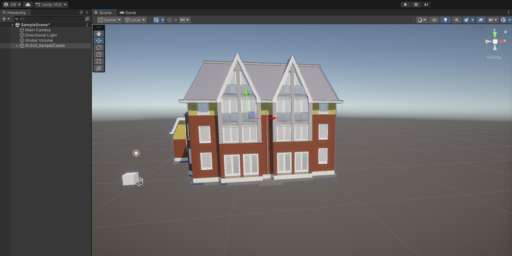
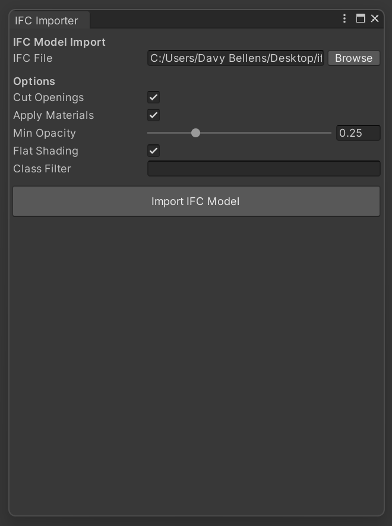
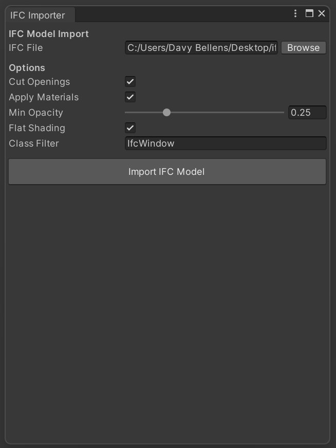
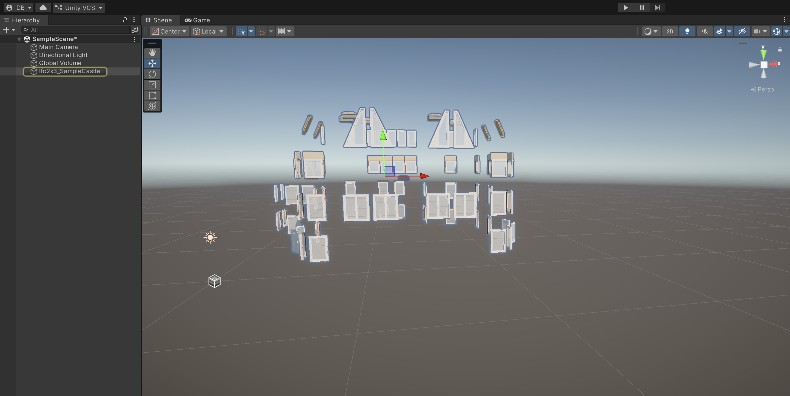

# IFC Import for Unity



Load Industry Foundation Classes (IFC) building models directly into Unity —
at runtime or from the Editor — with no external tools, no Python, and no
server round-trip.

The package parses `.ifc` files itself (a from-scratch STEP Part 21 reader),
resolves geometry through its own resource pipeline (extrusions, breps,
booleans for opening cuts), and builds the scene directly. Nothing outside
Unity's own APIs is required at runtime.



*The sample castle model, imported with default options — walls, windows,
and doors correctly cut and materials resolved, straight from the `.ifc`
file above.*

## Installation

Via the Unity Package Manager, using a git URL:

```
https://github.com/byvad/ifc-converter.git?path=/UnityPackage/com.byvad.ifc-import#v0.4.0
```

**Window > Package Manager > + > Install package from git URL**, paste the
above.

Verified on Unity 6000.3.4f1 and Unity 2022.3 LTS, and with URP 14. Supports IFC2X3 and IFC4.

## Quick start — runtime loading

Copy an `.ifc` file into `Assets/StreamingAssets/`, then:

```csharp
using UnityEngine;
using System.IO;
using Conversion.Unity;

public class IfcTest : MonoBehaviour
{
    void Start()
    {
        string path = Path.Combine(Application.streamingAssetsPath, "MyModel.ifc");
        var loader = gameObject.AddComponent<IfcRuntimeLoader>();

        loader.Load(path,
            new IfcLoadOptions { MinAlpha = 0.25 },
            OnComplete,
            OnProgress);
    }

    void OnProgress(float fraction, string stage) => Debug.Log($"[IFC] {stage} — {fraction:P0}");

    void OnComplete(IfcLoadResult result)
    {
        if (!result.Succeeded)
        {
            Debug.LogError($"[IFC] Load failed: {result.Error}");
            return;
        }
        Debug.Log($"[IFC] {result.Nodes} nodes, {result.Renderers} renderers, " +
                  $"{result.Triangles} tris, {result.Materials} materials, " +
                  $"{result.OpeningsCut} openings cut.");
    }
}
```

Parsing and geometry resolution run on a worker thread; scene instantiation
happens on the main thread in frame-budgeted batches, so a large model does
not freeze the game while it loads.

## Quick start — Editor import

**IFC > Import IFC Model...** opens an import window.


Pick a file, set options, click Import — the model is instantiated directly
into the open scene, with full Undo support.



Editor import runs synchronously with a progress bar — typically a few
seconds for a large model.

## Filtering by class

The **Class Filter** field restricts import to specific IFC classes.
Comma-separated, e.g. `IfcWall,IfcWindow`. Empty imports everything.



Importing the same file with `IfcWindow` in the filter brings in only the
windows — every other element (walls, roof, floors) is skipped entirely:



Useful for isolating one category from a large model, or building up a scene
in passes.

## Options

| `IfcLoadOptions` field | Default | Description |
| :--- | :--- | :--- |
| `IncludeOpenings` | `true` | Subtract `IfcRelVoidsElement` openings from their host. Off leaves every window/door buried in solid wall. |
| `Colour` | `true` | Resolve IFC surface styles and materials into URP materials. |
| `MinAlpha` | `0.25` | Opacity floor. IFC glazing is routinely authored fully transparent, which otherwise renders as invisible. |
| `SplitForFlatShading` | `true` | Split shared vertices so faces shade flat instead of smoothing across hard edges like wall corners. |
| `Layers` / `Schemas` / `Classes` | none | Restrict the import to specific conceptual layers, IFC schemas, or exact IFC classes (e.g. `IfcWall`, `IfcWindow`). |

## Known limitations

- No mesh instancing yet for repeated elements (e.g. identical windows via
  `IfcMappedItem`) — every element is a separate mesh and renderer.
- No `ScriptedImporter` — dropping an `.ifc` file into the Project window
  does not yet produce a prefab automatically; use the menu import or the
  runtime loader.
- Editor import blocks the UI thread while it runs.
- A handful of exotic geometry types (some boolean unions/intersections
  against non-planar solids) may be skipped; unsupported items are reported
  in the load result.

## Architecture: the layer descent

The conversion walks the four IFC conceptual layers, top to bottom, rather
than treating the file as a flat list of geometry:

- **Domain & Interoperability (Selection)** — decides which products get
  converted.
- **Core (Placement & Representation)** — resolves spatial placement,
  representation items, and opening voids for each selected product.
- **Resource (Geometry & Appearance)** — the mathematics: profiles, swept
  solids, breps, mesh booleans, and surface style resolution.

## Acknowledgements

Development and testing used the excellent sample `.ifc` files from [youshengCode/IfcSampleFiles](https://github.com/youshengCode/IfcSampleFiles) — including the castle model shown in the screenshots above. Not affiliated with this project; credit for the test data belongs entirely to them. If you're looking for more real-world IFC files to test against, that repo is a great place to start.

## Also in this repository

[`archive/`](archive/) holds earlier prototypes that led to this package: a
Python CLI and PySide6 desktop GUI that convert IFC to Wavefront OBJ/MTL
(using `ifcopenshell`), and intermediate C# drafts from before the package
settled into its current shape. They're kept for anyone curious about how
this got here, but they're not part of the Unity package, not installed by
it, and not actively maintained — treat them as historical reference, not a
supported tool.

## License

Source code is MIT-licensed — see
[LICENSE.md](UnityPackage/com.byvad.ifc-import/LICENSE.md).

The bundled IFC schema tables are derived from buildingSMART's IFC
specification (CC BY-ND 4.0), and the tool used to generate them is a
build-time-only dependency. See
[Third Party Notices.md](UnityPackage/com.byvad.ifc-import/Third%20Party%20Notices.md)
for full attribution.
